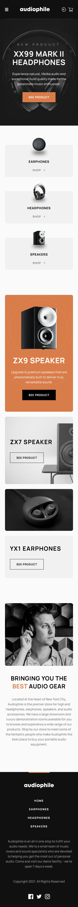
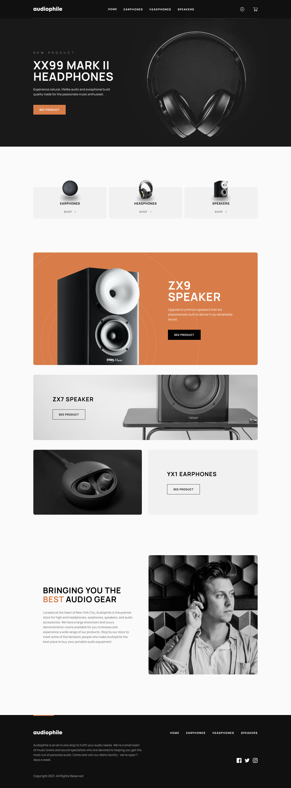

# Frontend Mentor - Audiophile e-commerce website

This is a solution to the [Audiophile e-commerce website challenge on Frontend Mentor](https://www.frontendmentor.io/challenges/audiophile-ecommerce-website-C8cuSd_wx). Frontend Mentor challenges help you improve your coding skills by building realistic projects.

## Table of contents

- [Overview](#overview)
  - [The challenge](#the-challenge)
  - [Screenshot](#screenshot)
  - [Links](#links)
- [My process](#my-process)
  - [Built with](#built-with)
  - [What I learned](#what-i-learned)
  - [Useful resources](#useful-resources)
- [Author](#author)

## Overview

### The challenge

Users should be able to:

- View the optimal layout for the app depending on their device's screen size
- See hover states for all interactive elements on the page
- Add/Remove products from the cart
- Edit product quantities in the cart
- Fill in all fields in the checkout
- Receive form validations if fields are missed or incorrect during checkout
- See correct checkout totals depending on the products in the cart
  - Shipping always adds $50 to the order
  - VAT is calculated as 20% of the product total, excluding shipping
- See an order confirmation modal after checking out with an order summary
- **Bonus**: Keep track of what's in the cart, even after refreshing the browser (`localStorage` could be used for this if you're not building out a full-stack app)

### Screenshot

### Links

- Solution URL: [https://github.com/PioKl/Audiophile-E-Commerce-Website]
- Live Site URL: [https://audiophile-e-commerce-website-mu.vercel.app/]

## My process

### Built with

- Semantic HTML5 markup
- CSS custom properties
- Flexbox
- CSS Grid
- Mobile-first workflow
- [Next.js](https://nextjs.org/) - React Framework
- [React](https://reactjs.org/) - JS library
- [Typescript](https://www.typescriptlang.org/) - JS syntax
- [Axios](https://axios-http.com/) - Promise based HTTP client for the browser and node.js
- [SVGR](https://react-svgr.com/docs/next/) - Transform SVGs into React components
- [MUI](https://mui.com/) - Material UI, React UI framework
- [React Toastify](https://www.npmjs.com/package/react-toastify) - A lightweight, customizable React library for displaying toast notifications in web applications
- [Body-Scroll-Lock](https://www.npmjs.com/package/body-scroll-lock) - Enables body scroll locking (for iOS Mobile and Tablet, Android, desktop Safari/Chrome/Firefox) without breaking scrolling of a target element (eg. modal/lightbox/flyouts/nav-menus).
- [Motion](https://motion.dev/) - A robust animation library for modern web projects using JavaScript, React, or Vue.

### What I learned

Practice with: Next and React(hooks, custom hooks, useEffect, routing, navigation with next, modals, mui modals, reusable components, transforming svg into component, usage of Image in next) and Typescript(generally and types/interface), grid, flex.

### Useful resources

- [Clamp Calculator](https://www.marcbacon.com/tools/clamp-calculator/) - To clamp fonts

## Author

- Website - [PioKl](https://github.com/PioKl)
- Frontend Mentor - [@PioKl](https://www.frontendmentor.io/profile/PioKl)
